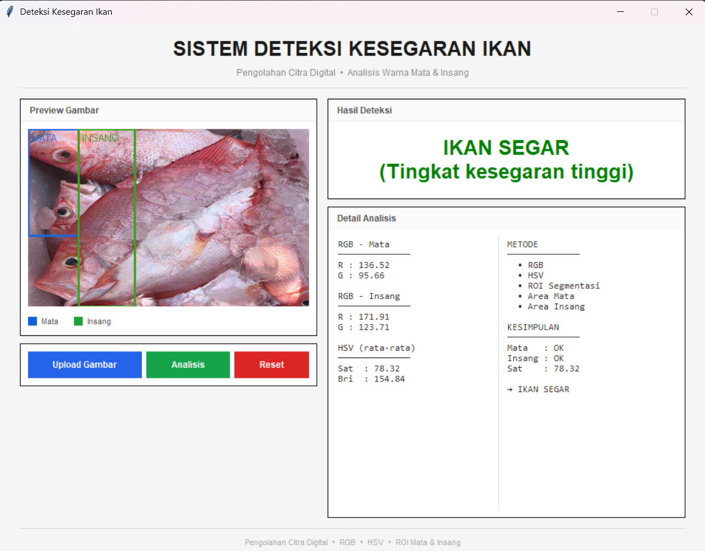
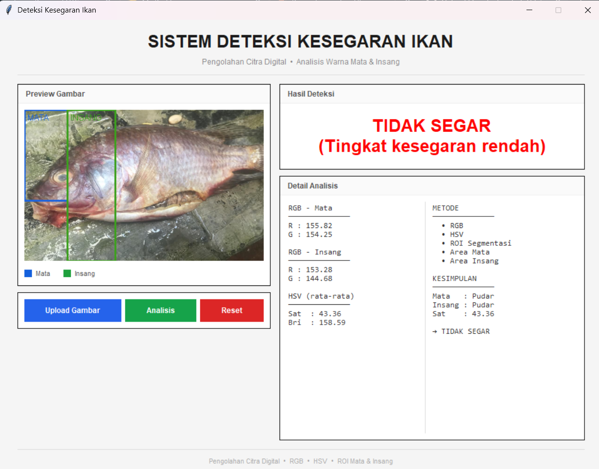

# Sistem Deteksi Kesegaran Ikan

Sistem deteksi kesegaran ikan berbasis pengolahan citra digital menggunakan analisis warna pada area mata dan insang ikan.

## Tampilan Program

<p align="center">
  
  
  width="40%" />
</p>

## Metode
- **RGB Analysis** — analisis nilai warna merah, hijau, biru
- **HSV Analysis** — analisis saturasi dan kecerahan warna
- **ROI Segmentasi** — deteksi area mata dan insang secara terpisah

## Cara Kerja
1. Upload foto ikan (menghadap ke kiri)
2. Klik tombol Analisis
3. Sistem mendeteksi 2 area ROI: **Mata** (kotak biru) dan **Insang** (kotak hijau)
4. Hasil klasifikasi: **Ikan Segar** / **Kurang Segar** / **Tidak Segar**

## Kebutuhan
```bash
pip install opencv-python pillow numpy
```

## Cara Menjalankan
```bash
python app.py
```

## Catatan
Pastikan foto ikan menghadap ke **kiri** agar ROI mata dan insang terdeteksi dengan tepat.
